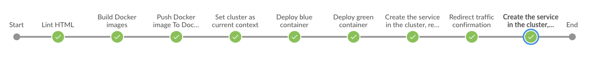

## Project Overview

This is the capstone project for Udacity's Cloud DevOps Nanodegree program.

In this project, we automate a web deployment from a code commit (Git) to an Amazon EKS cluster that is load balanced with blue/green deployment. We use Jenkins for this process.



Jenkins pipeline:
1. Lint HTML
2. Build Docker images for Blue and Green deployments
3. Push Docker images to Docker Hub (Docker Hub account required)
4. Set cluster as current context (Amazon EKS cluster required)
5. Deploy blue container 
6. Deploy green container
7. Create service in the cluster, redirect to Blue
8. Prompt for traffic redirection (Proceed/Abort)
9. If Proceed, we create service in the cluster and redirect to Green

## Setup the Environment

1. Install Jenkins on an Amazon EC2 server
2. Install Jenkins Plugins
- Blue Ocean
- Pipeline AWS

Then, add credentials for AWS and Docker Hub (Jenkins -> Credentials -> System -> Global Credentials).

3. Install and configure AWS CLI
4. Install AWS IAM Authenticator
5. Install eksctl
6. Install linter
7. Install and configure kubectl
8. Install Docker

### Create an Amazon EKS Cluster
```
eksctl create cluster --name capstone --without-nodegroup
```
Note: --name param does not support underscore (ie. capstone_cluster is not allowed)
```
eksctl create nodegroup --cluster capstone --name capstone-nodes --node-type t3.small --node-ami auto --nodes 3 --nodes-min 1 --nodes-max 3
```
### Troubleshooting
1. ssh to server logs in as ubuntu user. However, Jenkins pipeline runs commands as jenkins user. Make sure packages are installed for jenkins user. Otherwise, may encounter "aws" not found or "kubectl" config as empty. To switch to jenkins user, run "sudo -i -u jenkins"
2. Installation of plugins on Jenkins may fail with timeout error. This could be due to some mirrors malfunctioning. Try again after a while. 
3. Git repo root needs to have a Jenkinsfile in order for Jenkins pipeline to run
4. Create EKS cluster via AWS CLI, otherwise may encounter auth issues 

### References
AWS : EKS (ELASTIC CONTAINER SERVICE FOR KUBERNETES)
https://bogotobogo.com/DevOps/AWS/aws-EKS-Elastic-Container-Service-Kubernetes.php

Jenkins pipeline for blue green deployment using AWS EKS — Kubernetes — Docker 
https://medium.com/@andresaaap/jenkins-pipeline-for-blue-green-deployment-using-aws-eks-kubernetes-docker-7e5d6a401021

Create a kubeconfig for Amazon EKS
https://docs.aws.amazon.com/eks/latest/userguide/create-kubeconfig.html

Installing aws-iam-authenticator
https://docs.aws.amazon.com/eks/latest/userguide/install-aws-iam-authenticator.html

How To Install and Use Docker on Ubuntu 18.04
https://www.digitalocean.com/community/tutorials/how-to-install-and-use-docker-on-ubuntu-18-04

